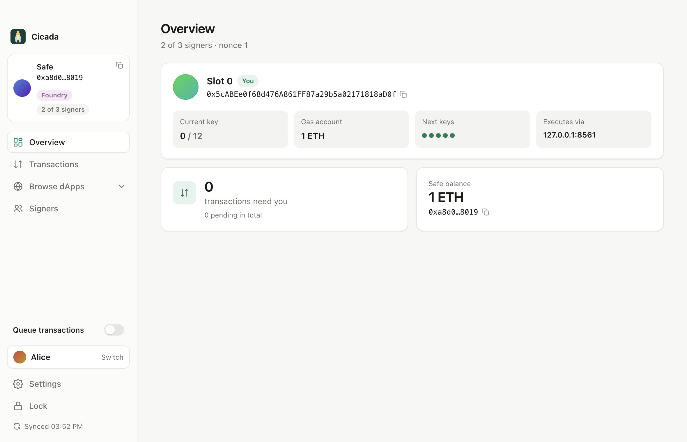
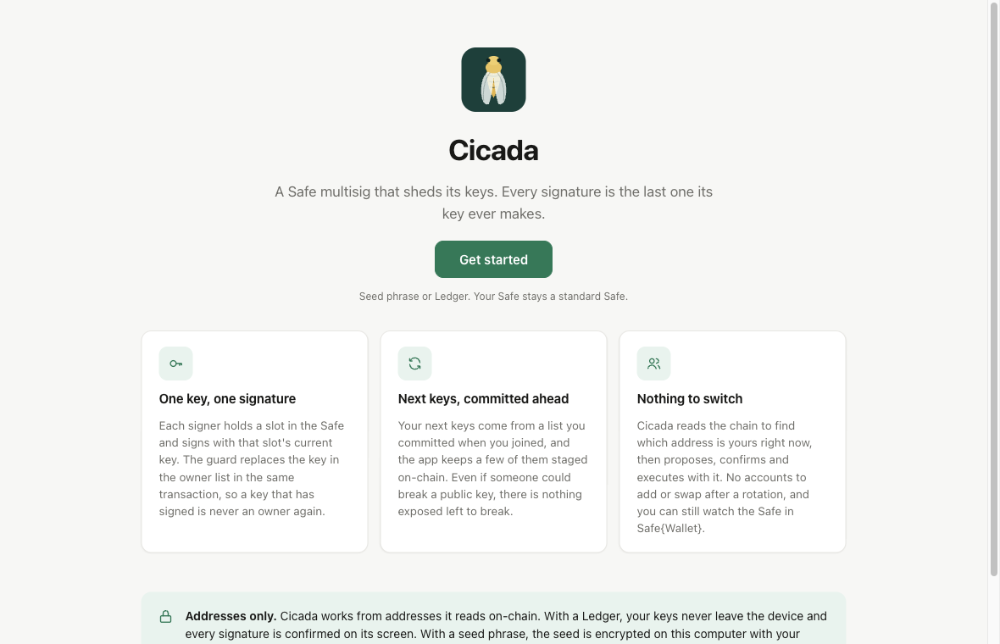
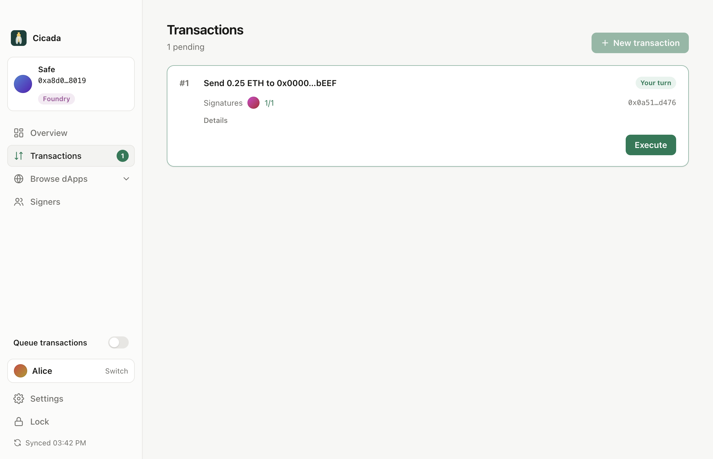
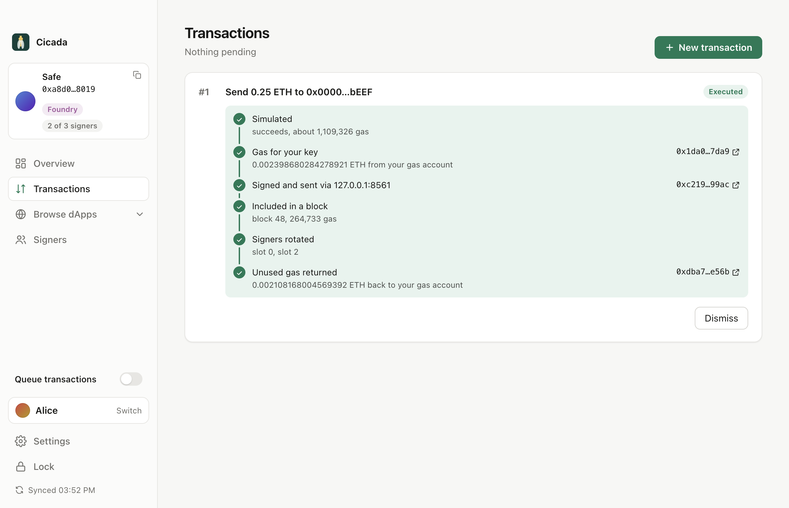
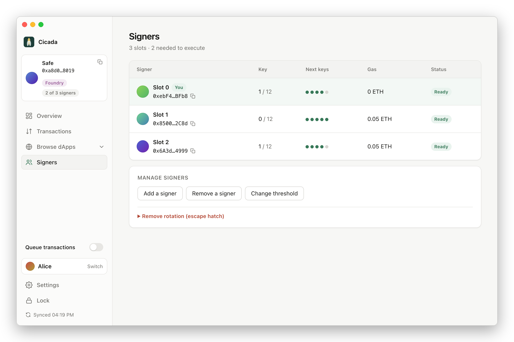

# Cicada

<br clear="left">

[](https://github.com/phonkmonk-r/rotating-msig/actions/workflows/test.yml)


A Safe multisig where no owner key signs twice. Each signature is the last thing its key ever does: the key is swapped out of the owner list in the same transaction, for a fresh one that was committed in advance. Cicada is the desktop app that makes this usable, and `RotationGuard` is the contract that enforces it.



## The problem

An Ethereum address is a hash of a public key. As long as a key has never signed anything, nobody knows its public key, and there is nothing to attack. The moment it signs, the public key is in the signature, on-chain, for good.

That is fine while deriving a private key from a public key is impossible. It stops being fine if that ever changes, whether through a large enough quantum computer or a flaw in secp256k1. Anything signed before that day was recorded and can be worked on afterwards. A multisig does not help by itself: its owner keys sign all the time, so every one of them is public.

A treasury expects to sit for years. Its signing keys should not be a bet on what cryptanalysis looks like in ten.

## What Cicada does

Cicada treats owner keys as single-use. You sign with the key that currently owns your slot, and that key stops being an owner in the same transaction. What replaces it is the next address from a list you committed when you joined, so an attacker who cracked the old key cannot pick its successor. At any moment, the current owners of the Safe are addresses whose public keys have never been seen.

The Safe stays a normal Safe 1.5.0. Safe{Wallet} still shows it, and the same Transaction Service queues proposals and confirmations. Cicada replaces the signing side: it knows which of your keys is current by reading the chain, signs with exactly that key, executes when it is your turn, and keeps your next keys staged.

## Screenshots









## How it works

**Slots and key lists.** Every signer owns one slot. When you join, your app derives a long list of addresses from your seed or Ledger (10,000 by default, each on its own path), builds a Merkle tree over them and commits the root on-chain. The list itself is not secret: it only holds addresses. The next five addresses of each slot are staged in the guard, each with a proof against the root. Staging is permissionless, since a proof is all it takes, so anyone may pay for it. Your own app does it from your gas account.

**A transaction.** Someone proposes: their signature is their confirmation, and it goes to the Transaction Service like any Safe signature. Other signers confirm the same way, but only up to one fewer than the threshold. The last signer does not confirm. They execute, so their signature goes straight on-chain and their account is the one sending the transaction. The guard checks the transaction before it runs: exactly `threshold` signatures, the executor among the signers, no signature from a key that is not an owner, no delegatecall except through MultiSendCallOnly, no approved-hash tricks. After the call, succeeded or not, it swaps every signer for the next staged key of their slot and checks that the owner list is still exactly one key per slot. A key that signed is never an owner again, even when the call it signed for reverted.

**Keys.** Cicada works from addresses. It reads each slot's current owner and tree index from the chain and derives that one key when it is time to sign. With a Ledger, the keys never leave the device and each signature is confirmed on its screen. With a seed phrase, the seed is encrypted on disk with your password (scrypt, AES-256-GCM), unlocked for the session and wiped on lock.

**Gas.** A fresh key has no ETH. Right before executing, the app sends the signing key just enough from your gas account (the first account of your seed, never an owner), and sweeps what is left back afterwards. Both transfers show up as steps in the execution view.

**Escape hatch.** A transaction that is exactly `setGuard(0)` on the Safe is let through without rotation, in case the guard itself is the problem. Its signers are not rotated, so their keys count as burned. The guard verifies that nothing but the guard changed.

**Running out.** Each key list is finite. When a slot runs low, the signer renews it from the app: a new list, a new root, same seed.

ARCHITECT.md walks through the contract, the packages and the app in detail. PLAN.md has the design history, the exposure analysis and what comes next.

## Limitations

This is a testnet project. It has not been audited, and it should not hold anything you would miss. The guard is deployed on Sepolia only. Deploying it currently sits right at Sepolia's per-transaction gas cap, which is why some views were dropped from the contract.

Off-chain confirmations are public before execution. Every confirmation posted to the Transaction Service reveals a public key that is still an owner until the transaction executes. The app caps that at one below the threshold, so what is exposed is never enough to sign, and allows one pending proposal at a time. The window is real, though. A signed transaction that never executes leaves those keys exposed; force-rotating the slots that signed it is a choice under New transaction, not something the app does on its own.

An execution that is sent but never mined exposes a full threshold of keys: the confirmers plus the executor. Handling this (resend, then force-rotate every signer of it at the same nonce) is designed but not built yet.

The app refuses to sign messages. Permits, sign-in with Ethereum, off-chain orders and anything else EIP-1271 would expose a key without rotating it, and the signature would stop verifying once owners rotate anyway. dApps that need a signed message to log in do not work through Cicada. CoW Swap and others fall back to on-chain approvals for Safes.

Safe{Wallet} is a viewer. The owner keys live only in Cicada, so nothing signs from Safe{Wallet}, and 1-of-1 Safes cannot transact from the app at all (proposing needs a threshold of two or more).

Rotation costs gas: roughly 50,000 to 75,000 per signer on top of a normal Safe transaction, plus staging and the gas transfers.

Never reuse an owner address on another chain. The key lists are bound to one chain and one Safe, and an address that signed elsewhere is exposed there.

Ledger profiles work through the app's code paths and tests, but signing has not yet been run on a physical device. The desktop app is not packaged or code-signed; run it from source.

## Running it

Requirements: Node 22, Foundry, and for the tests anvil.

```sh
npm install
forge build
npm run desktop -w @rotating-msig/signer
```

On first launch, add a profile from a seed phrase or a Ledger, and either paste the address of a Safe you are a signer of or create a new one with the other signers. Everything else is read from the chain.

Tests:

```sh
forge test                                   # the contract (the fork suite needs MAINNET_RPC_URL)
npm run typecheck && npm test                # TypeScript, with real Safe and guard contracts on anvil
npm run test:app -w @rotating-msig/signer    # Playwright drives the real desktop app
npm run screenshots -w @rotating-msig/signer # regenerates the images in screenshots/
```

## Layout

| Path | What |
|---|---|
| `src/RotationGuard.sol` | The guard: transaction guard, module and module guard in one singleton per chain. Tests in `test/`. |
| `packages/core` | Shared TypeScript: tree format, rules engine, proposals, Safe calldata, Transaction Service client. |
| `packages/keys` | Seed and Ledger key sources, derivation paths, slot discovery. |
| `signer` | Cicada: the signing session, the Electron app and its UI. Also the `rotation-signer` command-line server. |
| `generator` | Command-line tree generator, the original manual flow. |
| `app` | The earlier Safe App, kept for installing through Safe{Wallet}. |
| `deployments/` | Sepolia addresses. |
