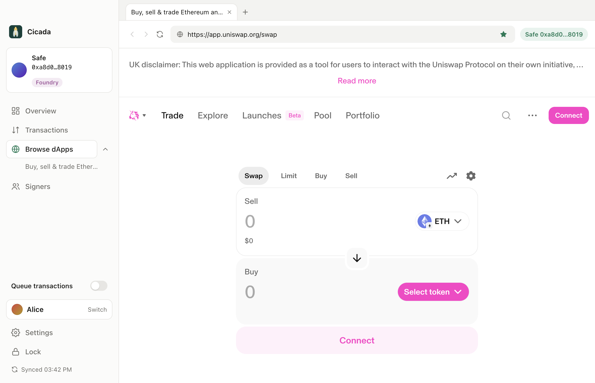

<p align="center">
  
</p>

<h1 align="center">Cicada</h1>

<p align="center">

[](https://github.com/phonkmonk-r/rotating-msig/actions/workflows/test.yml)


</p>

> [!CAUTION]
> Not audited, testnet only. Do not hold real funds with it.

A Safe multisig where no owner key signs twice. Every key that signs a transaction is replaced in that same transaction by a fresh key committed in advance, so the Safe's owners are always keys whose public keys have never been seen.

Why the name: a cicada climbs out of its shell and leaves the empty husk behind, as each signature leaves its exposed key.


## Why

A key's public key stays hidden until it signs. After that it is public forever. If recovering a private key from a public key ever becomes practical (a large quantum computer, a flaw in secp256k1), every key that has ever signed is at risk. Multisig owners sign constantly, so all of them are exposed. Cicada makes every owner key single-use.

## How it works

- **Contract.** `RotationGuard` is a Safe guard and module. After every transaction it swaps each signer for the next key of their slot, whether the call succeeded or not, and checks that the owners are still exactly one current key per slot.
- **Key lists.** Each signer's keys are derived from their seed or Ledger, one path per key. A Merkle root of the list is committed on-chain and the next five keys are staged with proofs.
- **App.** Cicada reads which key is current from the chain, signs with it, executes when it is your turn, stages your next keys, and funds the signing key with just enough gas, then sweeps the rest back.
- **Escape hatch.** A transaction that is exactly `setGuard(0)` removes the guard without rotating; its signers' keys count as burned.

[ARCHITECT.md](ARCHITECT.md) covers the contract, packages and app in detail. [PLAN.md](PLAN.md) has the design decisions and what is next.

## Screenshots





## Limitations

- Confirmations sit on the Transaction Service before execution, so their public keys are visible until it lands. The app keeps that below the threshold.
- A transaction that is sent but never mined leaves its signers exposed. The app tracks every signature it makes and offers a one-click rotation of the exposed slots.
- No message signing (permits, sign-in with Ethereum). It would expose a key without rotating it.
- Safe{Wallet} can view these Safes but not propose to them: the guard requires gas settings it does not set.
- Rotation costs roughly 45,000 to 70,000 gas per signer on top of a normal Safe transaction.
- Ledger signing has not been tried on a real device yet. The app runs from source; it is not packaged.

## Run it

Needs Node 22 and Foundry.

```sh
npm install
forge build
npm run desktop -w @rotating-msig/signer
```

Add a profile from a seed phrase or a Ledger, then join a Safe by its address or create a new one.

```sh
forge test                                   # contract
npm run typecheck && npm test                # TypeScript, against real contracts on anvil
npm run test:app -w @rotating-msig/signer    # the desktop app, driven by Playwright
npm run screenshots -w @rotating-msig/signer # regenerates screenshots/
```

## Layout

| Path | What |
|---|---|
| `src/RotationGuard.sol` | The guard. Tests in `test/`. |
| `packages/core` | Shared TypeScript: key lists, rules, proposals, Safe calldata, Transaction Service client. |
| `packages/keys` | Seed and Ledger key sources and derivation. |
| `signer` | Cicada: signing session, Electron app, UI, and a command-line server. |
| `generator` | Command-line key list generator. |
| `deployments/` | Sepolia addresses. |
